# Introdução às Finanças Corporativas

## Finanças corporativas e o administrador financeiro

**O que são finanças corporativas?**\
Quais são os investimentos de longo prazo?\
Quais ativos você deve adquirir?\
Onde você conseguirá o financiamento de longo prazo?\
Qual a estrutura de capital?\
Capital próprio? Capital de terceiros?\
Como administrar ativos e passivos de curto e longo prazos?\


**O administrador financeiro**

CFO - *Chief of Financial Office*\
Controla a Tesouraria - tesouraria, crédito, investimentos e planejamento financeiro\
Controla a Controladoria - tributos, contabilidade de custos e financeira e TI


```{r, echo=FALSE, out.width='100%', fig.cap='Quadro organizacional simplificado de uma empresa estadunidense', fig.pos='!htb', fig.topcaption=TRUE}
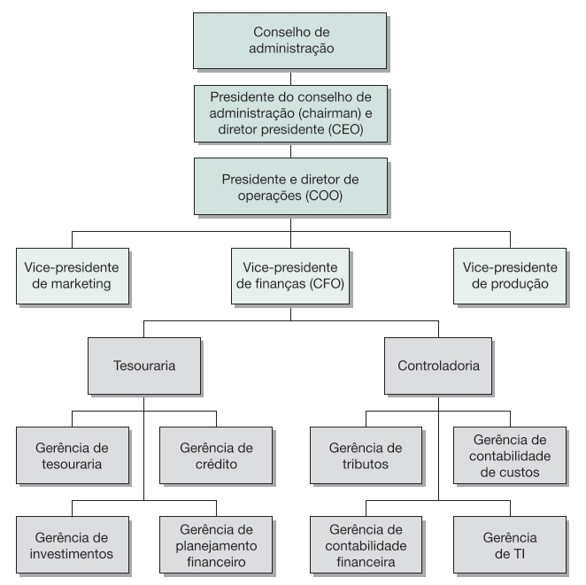
```
<span style="font-size: 80%">
Fonte: [@ross2013fundamentoscp1 pg.3]
</span>
<br>

```{r, echo=FALSE, out.width='100%', fig.cap='Organograma da Petrobras S.A. (março de 2023)', fig.pos='!htb', fig.topcaption=TRUE}
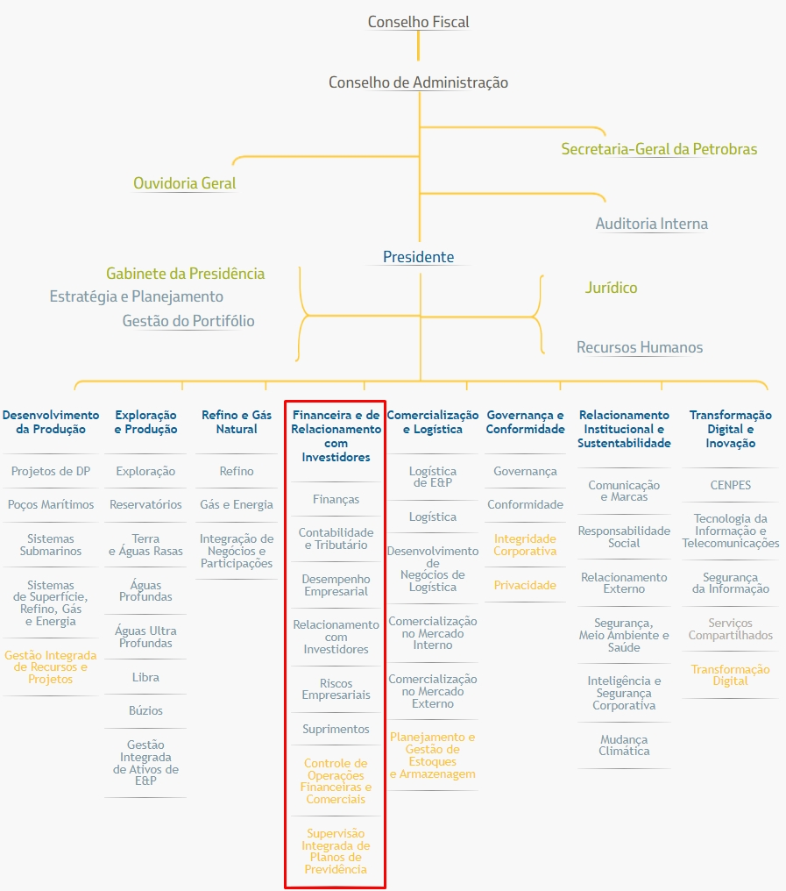
```
<span style="font-size: 80%">
Fonte: (Petrobras, <https://petrobras.com.br/pt/quem-somos/organograma/>).
</span>
<br>

## Decisões de administração financeira

### Orçamento de Capital

Objetivo - identificar negócios em que o **valor do fluxo de caixa gerado** por um ativo **deve exceder** o seu custo de aquisição, "carregamento de estoques", manutenção e despesas financeiras várias.

Fechar / Abrir uma outra loja?\
Fechar / Reduzir / ampliar a capacidade instalada?\
Mantes / Adquirir uma nova tecnologia?\
Retirar / Adicionar um produto do mercado?\
Adquirir um concorrente?\

Avaliar o volume de recursos\
Avaliar os rendimentos esperados\
Avaliar o tempo, o tamanho e o risco dos fluxos de caixa\
<br>

```{r, echo=FALSE, out.width='100%', fig.cap='Segmentos de negócios da Vale em 2018', fig.pos='!htb', fig.topcaption=TRUE}
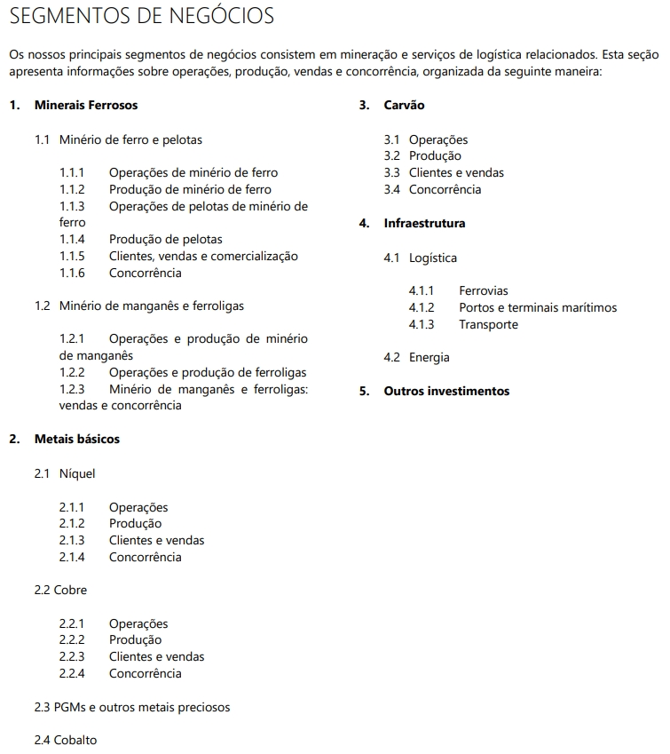
```
<span style="font-size: 80%">
Fonte: [@Vale20F2018 pg.35]
</span>
<br>

```{r, echo=FALSE, out.width='100%', fig.cap='Principais atividades dos segmentos operacionais da Vale em 2020', fig.pos='!htb', fig.topcaption=TRUE}
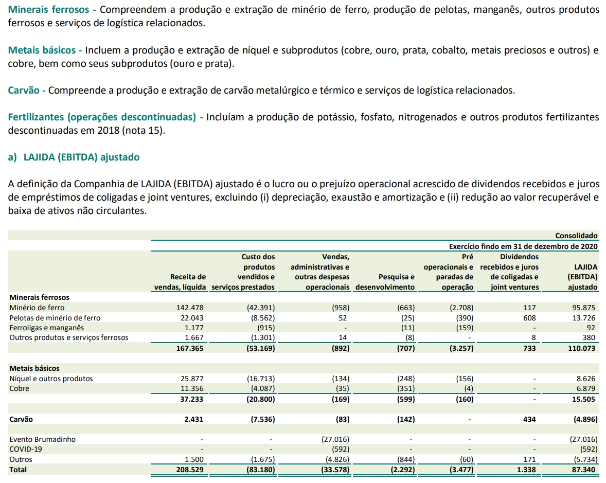
```
<span style="font-size: 80%">
Fonte: [@Vale20DF2020 pg.21]
</span>
<br>

```{r, echo=FALSE, out.width='100%', fig.cap='Notas explicativas às Demonstrações Financeiras da Vale em 2020 (em milhões de reais)', fig.pos='!htb', fig.topcaption=TRUE}
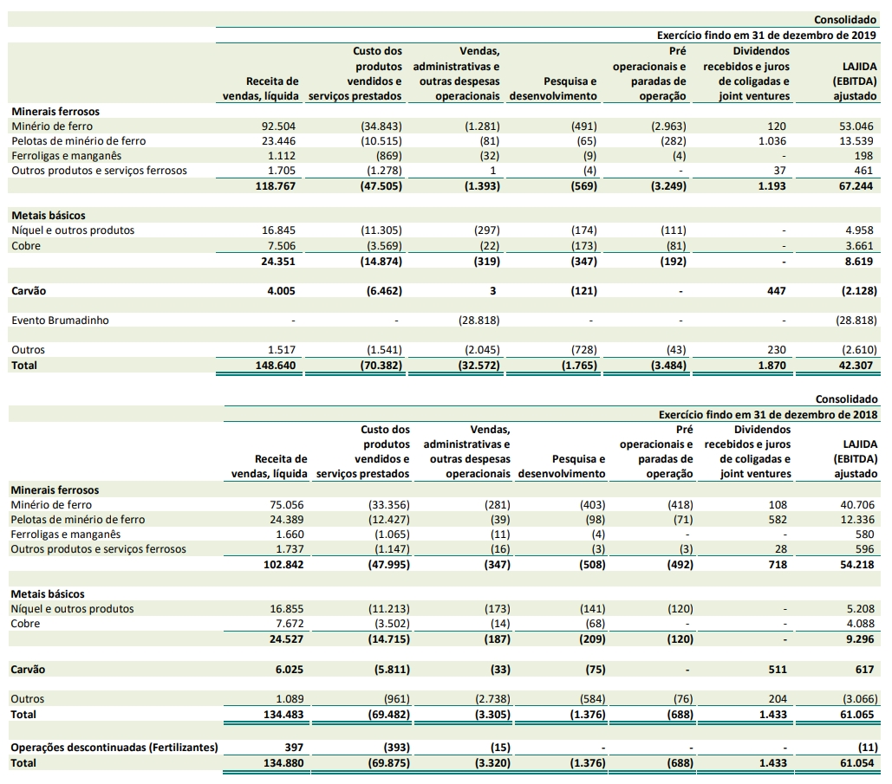
```
<span style="font-size: 80%">
Fonte: [@Vale20DF2020 pg.22]
</span>
<br>

```{r, echo=FALSE, out.width='100%', fig.cap='Segmentos de atuação da BRF S.A. em 2020', fig.pos='!htb', fig.topcaption=TRUE}
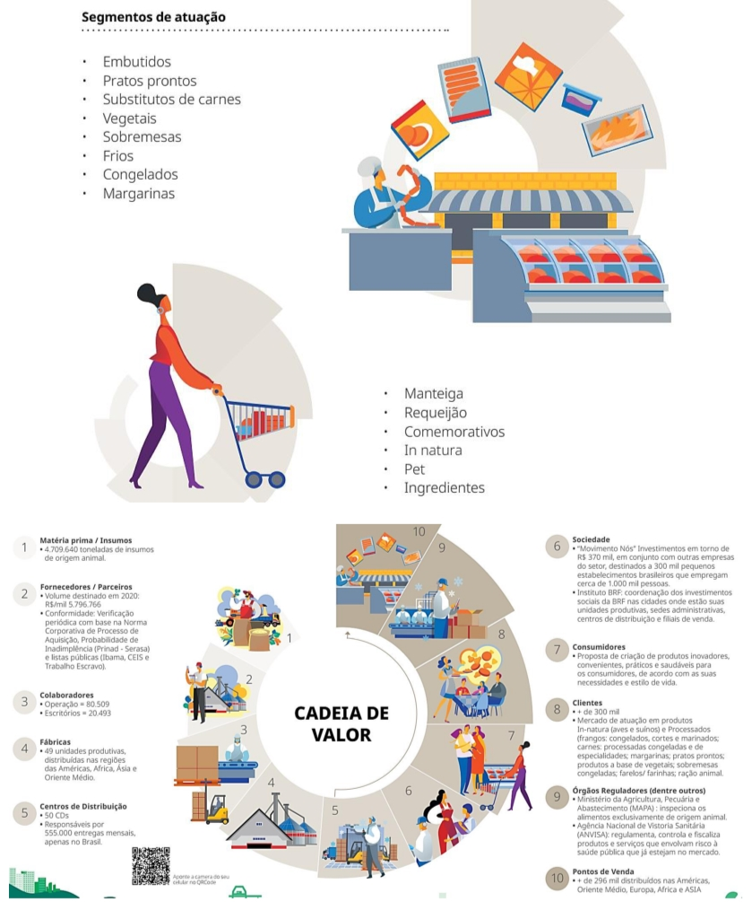
```
<span style="font-size: 80%">
Fonte: [@BRFDF2020]
</span>
<br>

```{r, echo=FALSE, out.width='100%', fig.cap='Demonstrativo do Resultado do Exercício (DRE) da BRF S.A. em 2020', fig.pos='!htb', fig.topcaption=TRUE}
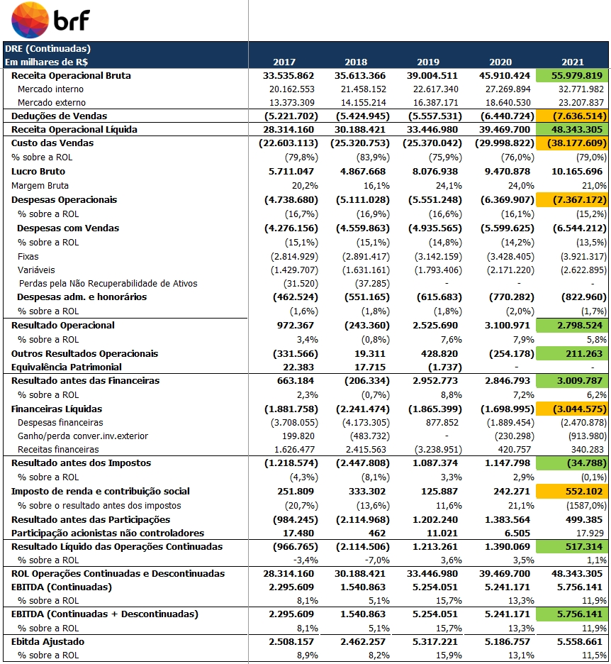
```
<span style="font-size: 80%">
Fonte: [@BRFDF2020]
</span>
<br>

### Estrutura de Capital

**Como a empresa obtém e administra o financiamento?**\
**Qual a combinação entre passivo e patrimônio líquido?**\
**Quanto a empresa deve tomar emprestado?**

Como a estrutura de capital afeta o risco?\
Como a estrutura de capital afeta o valor da empresa?

Quais são as fontes baratas?\
Como distribuir o endividamento entre as várias fontes?\
Em que moeda deve tomar emprestado?

Qual o prazo?\
Quais as garantias?\
Qual a flexibilidade financeira?\
Qual a liquidez no mercado?
<br>

```{r, echo=FALSE, out.width='100%', fig.pos='!htb', fig.topcaption=TRUE}
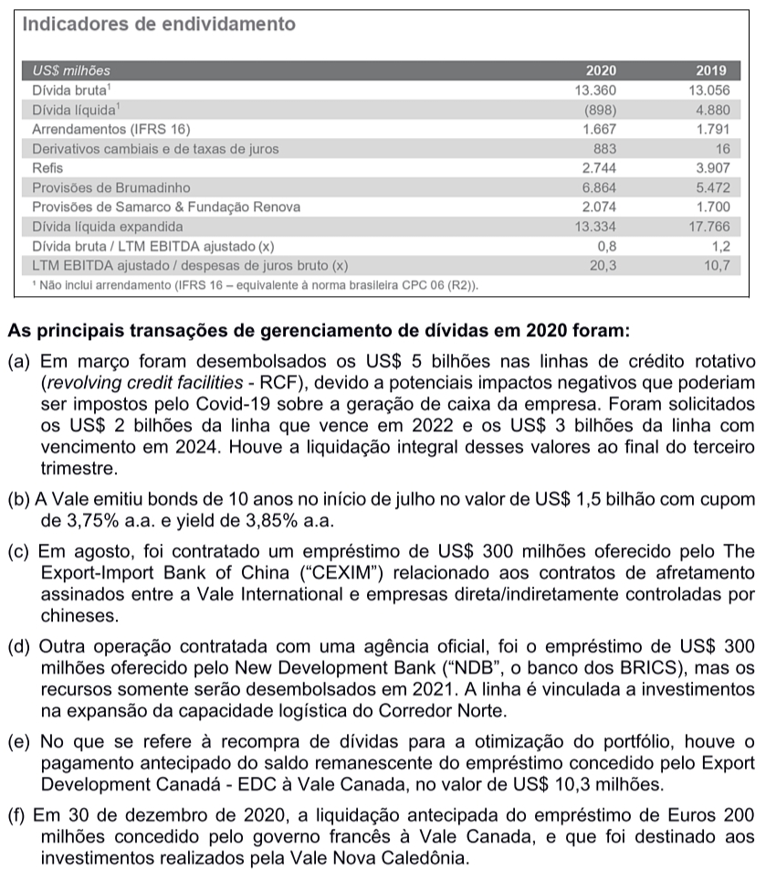
```
<br>

```{r, echo=FALSE, out.width='100%', fig.cap='Balanço Patrimonial (BP) da BRF S.A. em 2020', fig.pos='!htb', fig.topcaption=TRUE}
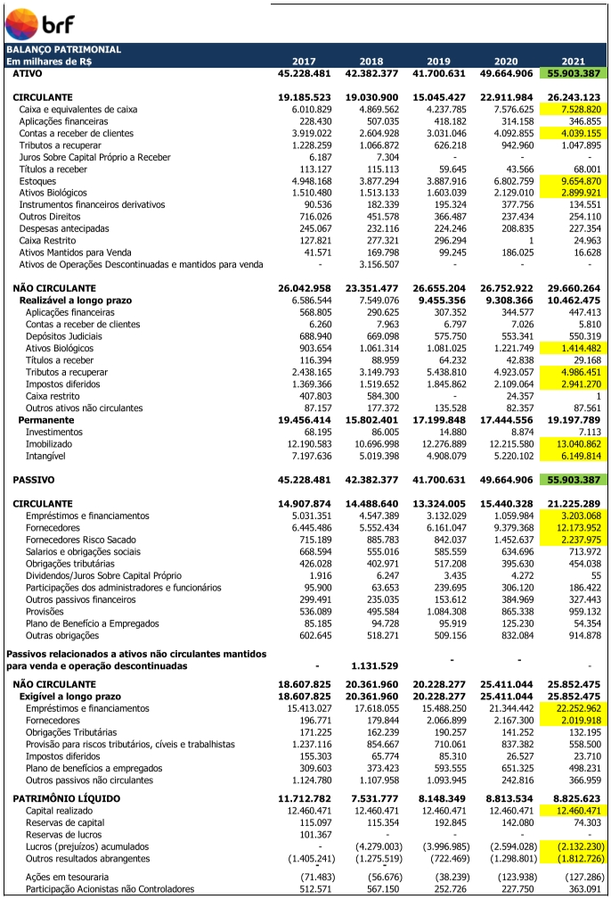
```
<span style="font-size: 80%">
Fonte: [@BRFDF2020]
</span>
<br>

### Administração do Capital Circulante

Capital circulante ou ativo circulante\
Atividade diária\
Combinar recursos da entrada e saída de caixa da empresa\

Quanto de caixa e estoque deve ser mantido?\
Comprar a crédito e vender a prazo?\
Como combinar preços, riscos e prazos?\
Quais as condições de venda?

Como obter o financiamento de curto prazo?\
Como evitar problemas de liquidez no curto prazo?

#### Conclusão

**1. Orçamento de capital (valoração de ativos - usos)**\
**2. Estrutura de capital (financiamento de ativos - recursos)**\
**<span style="color:red">3. Administração de capital circulante</span>**

## Formas de Organização de Negócios

**Microempreendedor Individual - MEI**\
Lei Complementar nº 128/2008 que alterou a Lei Geral da Micro e Pequena Empresa (Lei Complementar nº 123/2006) cria a figura do Microempreendedor Individual.

Para ser um MEI é necessário faturar até R$ 81 mil por ano, não ter participação em outra empresa como sócio ou titular e ter no máximo um empregado contratado que receba o salário-mínimo ou o piso da categoria.

O MEI será enquadrado no Simples Nacional e ficará isento dos tributos federais (Imposto de Renda, PIS, Cofins, IPI e CSLL).

**Empresa Individual de Responsabilidade Limitada**\
Lei 12.441/2011

**Sociedade**\
Um ou mais sócios\
Organização descrita no contrato de sociedade

**Sociedade em nome coletivo**\
A administração da sociedade é exclusiva dos sócios

**Sociedade simples**\
Dois tipos de sócios: comanditário (delibera e fiscaliza) e comanditado (gestão)\
Comanditário: sócio sem ingerência na gestão dos negócios

**Sociedade limitada (LTDA)**\
Sócios/quotas e responsáveis pelo capital social\
Administrador não sócio.

**Sociedade por Ações (S.A. “Fechada”)**\
Sócio/Ações\
Somente os acionistas podem administrar\
O administrador responde subsidiária e ilimitadamente pelas obrigações da sociedade.

**Sociedade Anônima ou Companhia (S.A. “Aberta”)**\
Sócio/Ações\
Acionista tem sua obrigação limitada ao capital integralizado ao preço das ações.\
Lei das Sociedades por Ações (Lei 6404/76)\
Na forma de sociedade aberta, a separação entre propriedade e gestão é mais definida.

**Companhia aberta – Sociedade por Ações de Capital Aberto**\
Pessoa Jurídica $\neq$ Pessoa Física\
Contratos e Estatutos\
Acionistas e Conselheiros\
Acionistas elegem conselheiros\
Diretoria executiva supervisionada pelo Conselho de administração\
Acionistas e administradores são grupos separados

**Separação da propriedade e da gestão**\
Acionistas tem responsabilidade limitada pelas dívidas das empresas\
Dupla tributação nos EUA? Não ocorre dupla tributação no Brasil!\
Política de dividendos é exclusiva das corporações SA

<br>
```{r, echo=FALSE, out.width='100%', fig.cap='Corporações internacionais', fig.pos='!htb', fig.topcaption=TRUE}
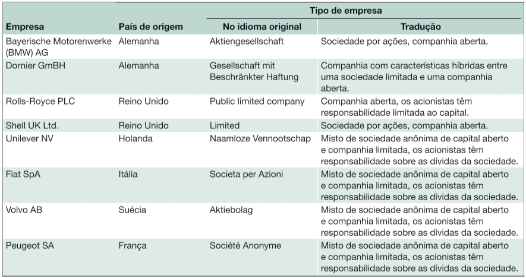
```
<span style="font-size: 80%">
Fonte: [@ross2013fundamentoscp1 pg.9]
</span>
<br>

## O objetivo da administração financeira

**Objetivos possíveis?**

Minimizar custos – ok\
Maximizar lucros - ok\
Manter o crescimento dos lucros – ok, reduzir volatilidade

Sobreviver - ok\
Evitar a falência - ok\
Evitar problemas financeiros - ok

Superar a concorrência?\
Maximizar taxa de lucro?\
Maximizar as vendas?\
Maximizar a participação de mercado?

**Combinar objetivos?**

Qual massa de lucro?\
Quando? Em que momento?\
Como? Qual estratégia?\
Quais mercados? Quais produtos?\
Esse objetivo não é preciso

**Um objetivo mais geral**

Maximizar o valor do patrimônio dos controladores/proprietários no longo prazo\
Maximizar como? Qual a estratégia para maximizar?

**O objetivo da administração financeira**

Maximizar o valor unitário corrente das ações existentes?\
Maximizar o valor unitário das ações existentes em algum momento?

Quem afirmaria o oposto?\
Afirmação vaga e irrelevante do ponto de vista decisório e estratégico.\
Questão central do curso: quais instrumentos básicos para esta tomada de decisão!

**Sarbanes-Oxley (SOX)**

Forma de divulgação de informações das empresas listadas em bolsa\
Escândalos corporativos: Enron, WorldCom, Adelphia etc.\

Proíbe empréstimos pessoais de uma empresa para seus executivos\
SOX responsabiliza a administração pela exatidão das demonstrações financeiras\
Elevados custos para se adequar a lei.

A empresas brasileiras com ações na NYSE devem se adequar a SOX\
CVM possui regulamentações parecidas com a SOX

## O problema de agência e o controle da empresa

Relacionamento de agência\
Objetivos da administração\
Os administradores buscam os interesses dos acionistas?

**Problema de agência: Agente e Principal**

Acionistas $\rightarrow$ Conselheiros $\rightarrow$ Administradores\
Há uma divergência entre os interesses de acionistas e administradores

Conflitos referentes as estratégias empresariais?\
Conflitos referentes a posicionamento de cada acionista?\
Conflitos entre acionistas e conselheiros?\
Conflitos entre conselheiros e administradores?\
Conflitos entre acionistas e administradores?\
Conflitos entre debenturistas, administradores, conselheiros e acionistas?\
Conflitos entre diretores?
<br>

```{r, echo=FALSE, out.width='100%', fig.cap='Composição Acionária da BRF S.A. em 26/07/2022', fig.pos='!htb', fig.topcaption=TRUE}
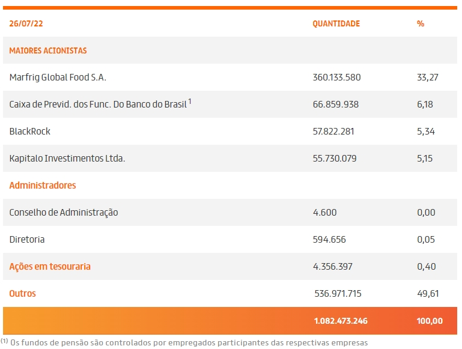
```
<span style="font-size: 80%">
Fonte: (BRF, <https://ri.brf-global.com/governanca-corporativa/composicao-acionaria/>)
</span>
<br>

**Remuneração dos administradores**

Remuneração vinculada a lucros e valor das ações\
Incentivo: opções para comprar ações a preços de barganha\
Incentivo: emprego\
Incentivo: participação nos lucros


**Controle da empresa**

Ameaças de take-over e demissão da administração\
Comportamento de investidores (bancos, fundos de investimentos e acionistas)\
Remuneração em empresas concorrentes\
Yardstick competition


**Públicos de relacionamento (stakeholders)**

Stakehorders $\neq$ Stockholders\
Stockholders = é acionista ou credor (debenturista, bancos etc)\
Stakehorders = não é acionista ou credor e tem interesse sobre os fluxos de caixa\
Stakehorders = Funcionários e sindicatos, clientes e usuários, fornecedores, governos

**O Novo Mercado**\
**Níveis diferenciados de governança corporativa criados pela BM&FBovespa**

Regras mais rígidas de governança corporativa\
Regras mais rígidas reduzem o risco de investidores\
Informações mais completas\
Administração profissionalizada\
Novo Mercado: somente ações com direito a voto (ON)

<br>
```{r, echo=FALSE, out.width='100%', fig.cap='Principais diferenças entre os segmentos especiais de listagem do mercado de ações na BM&FBOVESPA', fig.pos='!htb', fig.topcaption=TRUE}
knitr::include_graphics("Aula01_fig12.jpg")
```
<span style="font-size: 80%">
Fonte: [@ross2013fundamentoscp1 pg.16]
</span>
<br>

## Mercados financeiros e a Empresa

S.A. – transferência rápida de propriedade (liquidez)\
S.A. – limitada responsabilidade do investidor\
S.A. – ampliação da capacidade de financiamento\
S.A. – regulação rígida na divulgação de informações (DRE, BP e relatórios)


**Mercado de Capitais**

**Mercados primários**

A empresa recebe recursos no lançamento de ações\
IPO, novas ações e chamada de capital são exemplos\
Ofertas devem ser registradas na CVM

**Mercados secundários**

A empresa não recebe recursos de forma direta\
São importantes, pois oferecem liquidez: possiblidade de compra\
As ações balizam e influenciam os mercados financeiros e o crédito da empresa


**Mercados de balcão (dealers) versus mercado de bolsa (*auction markets*)**

Over the counter (OTC)\
A maioria das negociações de títulos de dívida ocorre nesse mercado\
As corretoras são os grandes agentes desse mercado\
As corretoras interligadas constituem um mercado paralelo ou mercado de balcão


**Negociação de títulos de empresas**

NASDAQ – mercado de balção eletrônico de corretoras de valores no EUA\
NASDAQ tem duas vezes o número de empresas que a NYSE\
Nesse mercado de balcão as empresas são menores e menos ativas\
O valor de mercado das ações da NASDQ é inferior ao da NYSE\
Enorme mercado de OTC para dívidas\
Muitos mercados são criados dentro de bancos para seus clientes

**Listagem em bolsa**

Quantas e quais empresas estão na NYSE?\
Quantas e quais empresas estão na BM&FBovespa?\
Quantas e quais empresas estão na NASDAQ?


## Resumo e conclusões

1 – Orçamento de capital, estrutura de capital e administração do capital circulante.

2 – Maximizar o valor da empresa e do patrimônio dos acionistas.

3 – SA é uma forma superior de organização dos negócios (transferência de propriedade e responsabilidade limitada dos acionistas/quotistas/investidor).

4 – Existem conflitos variados entre acionistas, conselheiros e administradores.

5 – Mercados financeiros são importantes para as empresas, em particular para as SA.


