# Demostrações Contábeis, Impostos e Fluxos de Caixa

```{r, echo=FALSE, out.width='100%', fig.cap='Fluxos de caixa entre a empresa e os mercados financeiros', fig.pos='!htb', fig.topcaption=TRUE}
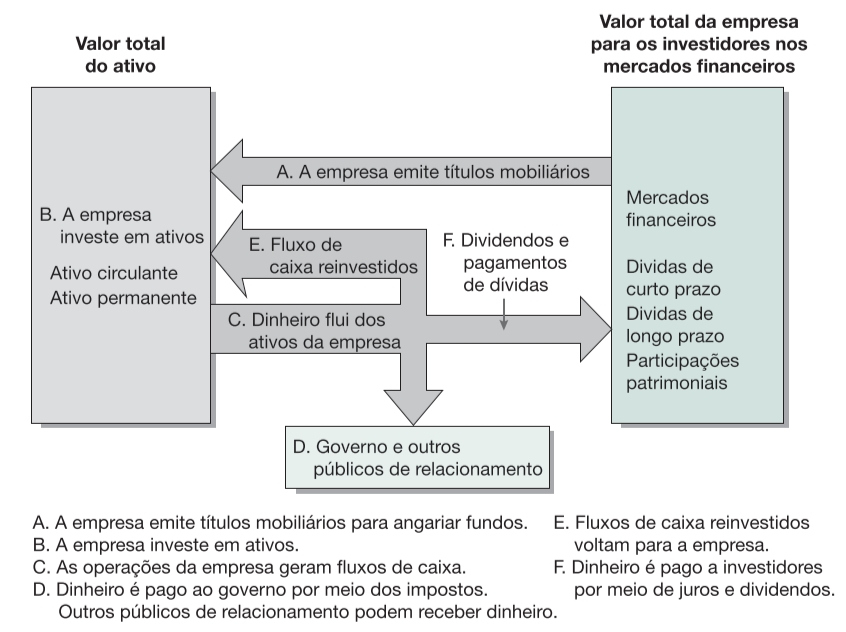
```
<span style="font-size: 80%">
Fonte: [@ross2013fundamentoscp1 pg.19]
</span>
<br>

- Diferença entre valor contávil e valor de mercado\
- Diferença entre lucro contábil e fluxo de caixa\
- Diferença entre as alíquotas tributárias médias e marginais\
- Determinar o fluxo de caixa de uma empresa a partir de suas demonstrações contábeis

## O balanço patrimonial

- Balanço Patrimonial;
- Demonstração dos Resultados do Exercício (DRE);
- Demonstração dos Fluxos de Caixa;
- Demonstração do Valor Adicionado;
- Demonstrativos Patrimoniais ou Demonstrativos dos Lucros ou Prejuízos Acumulados;

**Ativos: o lado esquerdo**\
Ativo circulante (estoque de matérias-primas e produtos acabados)\
Ativo circulante (contas a receber com prazo inferior a uma)\
Ativo não-circulante (imobilizado, como prédios e máquinas e caminhões)\
Ativo não-circulante (intangível, como uma patente ou marca)

**Passivos e patrimônio líquido (equity): o lado direito**\
Passivo circulante (dívidas a serem pagas em um ano)\
Passivo não-circulante (títulos de dívida, empréstimos de longo prazo, +2, +5 anos)\
Patrimônio líquido ou capital próprio (equity)

<br>
```{r, echo=FALSE, out.width='100%', fig.cap='O balanço patrimonial. Lado esquerdo: valor total dos ativos. Lado direito: valor total dos passivos e do patrimônio líquido', fig.pos='!htb', fig.topcaption=TRUE}
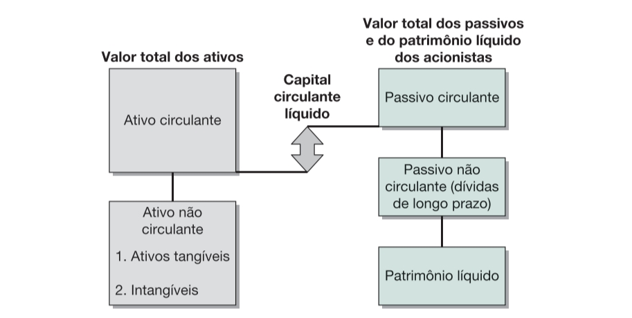
```
<span style="font-size: 80%">
Fonte: [@ross2013fundamentoscp2 pg.25]
</span>
<br>

<br>
```{r, echo=FALSE, out.width='100%', fig.cap='Estrutura do Balanço Patrimonial', fig.pos='!htb', fig.topcaption=TRUE}
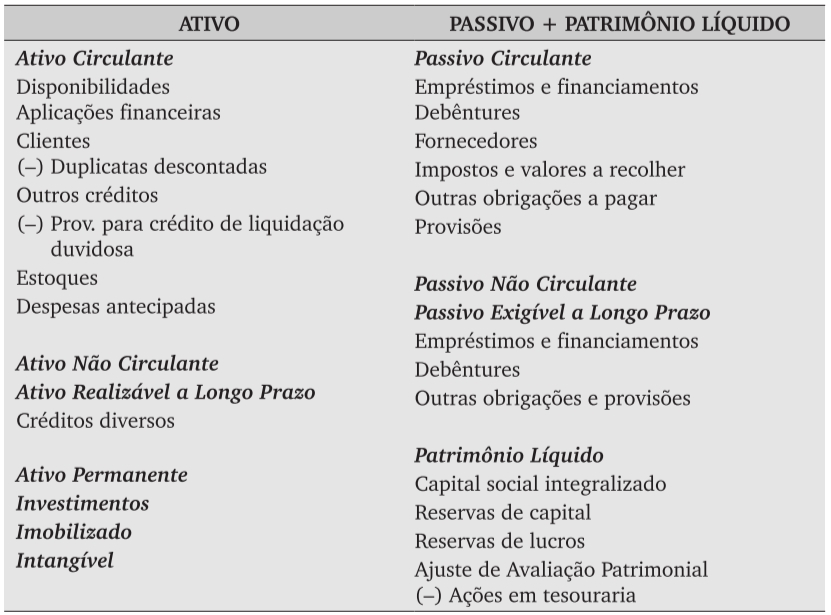
```
<span style="font-size: 80%">
Fonte: [@assaf2014financcascp5 pg.105]
</span>
<br>

<br>
```{r, echo=FALSE, out.width='100%', fig.cap='Estrutura da Demonstração do Resultado do Exercício', fig.pos='!htb', fig.topcaption=TRUE}
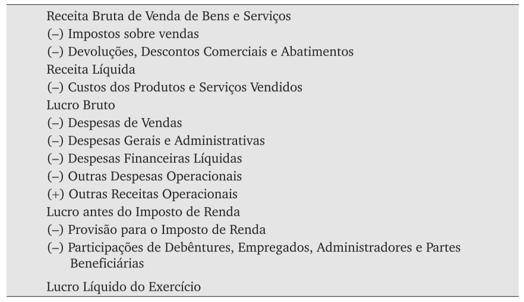
```
<span style="font-size: 80%">
Fonte: [@assaf2014financcascp5 pg.111]
</span>
<br>

**Capital circulante líquido**

$$
\mathrm{capital\;circulante\;líquido = ativo\;circulante - passivo\;circulante}
$$


Se negativo em um horizonte de um ano, pode-se ter um problema de liquidez, mas não um problema econômico financeiro grave, por exemplo, falência.

A estrutura de ativos reflete o ramo de negócios, a indústria, os mercados e a estratégia da empresa. Não existe um padrão geral, mas sim condicionado por essa inserção industrial\produtiva.


**Liquidez**

Velocidade e facilidade com que os ativos podem ser convertidos em caixa.\
Facilidade de Conversão X Perda de Valor.\
Existência de **mercado secundários e ativos não-específicos** aumenta a liquidez.

Os ativos imobilizados e específicos são os menos-líquidos.\
Quando maior a liquidez, melhor.\
A manutenção de ativos líquidos pode ser custosa ou apresentar menor rendimento.\
Como explicar/justificar?


**Dívida e Patrimônio**

$$
\mathrm{valor\;residual\;da\;empresa = ativos – passivos}
$$
O uso de dívidas na estrutura de capital é chamado de **alavancagem financeira**.\
Quanto maior a dívida, maior a alavancagem financeira.\

**Suposto geral da alavancagem**: Recursos geridos pela empresa oferecem um retorno superior ao custo do capital obtido com terceiros.

A alavancagem aumenta a recompensa potencial dos acionistas.\
A alavancagem aumenta a despesa financeira.\
A alavancagem aumenta o risco dos acionistas e de fracasso nos negócios.

**Valor de Mercado X Valor Contábil**

Valores contábeis.\
Custos históricos.\
Valor que a empresa pagou pelos ativos.

Valor contábil deve ser ajustado ao seu valor recuperável (exemplo: *impairment*).\
Valor de custo recuperável (venda).\
Valor da empresa é valor de mercado.

A diferença entre o valor de mercado e o valor contábil é importante para entender o impacto dos lucros e das perdas demonstradas.

Quando ocorrem **grandes mudanças econômicas**, a administração da empresa deverá realizar o chamado **teste de recuperação de ativos** (*impairment*) e **ajustar o valor contábil** ao resultado dessa avaliação.

O **valor líquido da venda** seja o valor a ser obtido em **condições normais de negociação** entre partes conhecedoras e independentes, deduzidas as despesas necessárias para que ocorra a venda.

O **valor em uso** seja o valor presente de fluxos de caixa futuros estimados, que devem resultar do ativo.


:::: {.blackbox data-latex=""}
::: {.center data-latex=""}
**Lucro da BHP Billiton cai 37% no ano fiscal de 30/06**
:::

<span style="font-size: 80%">
Por **Valor, com Dow Jones Newswires**
</span>

**SÃO PAULO - A BHP Billiton registrou queda anual de 37% do lucro líquido** no ano fiscal de 2018, encerrado em 30 de junho, para US\$ 3,71 bilhões. O resultado foi impactado, segundo a empresa, por **uma perda excepcional de US\$ 5,2 bilhões, causada principalmente por uma baixa contábil (‘impairment’) de US$ 2,86 bilhões relacionada à venda dos ativos de petróleo e gás onshore nos Estados Unidos e pelo rompimento da barragem da Samarco, uma joint venture da BHP com a brasileira Vale, com 50% cada.**

A perda referente à Samarco corresponde a US$ 650 milhões de 2018.

O lucro antes de juros, impostos, depreciação e amortização (Ebitda, na sigla em inglês) ajustado apurou um avanço de 20%, para US\$ 23,2 bilhões. A receita total teve um crescimento de 20% ante o mesmo período do ano passado, para US$ 45,8 bi.

A BHP também anunciou o pagamento de dividendo de US\$ 0,63 por ação, levando a empresa a um dividendo de US\$ 1,18 por ação em todo o ano, um valor superior aos US$ 0,83 de um ano antes.

A dívida líquida da BHP recuou 33% no ano fiscal de 2018, para US$ 10,9 bilhões.

<span style="font-size: 80%">
Fonte: [@valor201808]
</span>
::::
<br>

```{r include=FALSE}
# import library
library(tidyverse)
library(dygraphs)
library(quantmod)
  
# download data
start_date <- as.Date("2018-01-01")
end_date <- as.Date("2018-12-31")
getSymbols("BHP", src = "yahoo", from = start_date, to = end_date)

# view top 5 row data
head(BHP,n=5)
  
# Get OHLC data 
price<-OHLC(BHP)
head(price, n=5)

ggbhp <- price %>% 
  dygraph(main = "Preço das ações da BHP (Dólares norte-americanos correntes)") %>% 
     dySeries("BHP.Close",
              color = "black") %>%
     dyShading(from = "2018-08-20",
               to = "2018-08-21", 
               color = "red") %>% 
  dyRangeSelector()
```

```{r echo=FALSE, out.width='100%', fig.pos='!htb', fig.topcaption=TRUE}
dyCandlestick(ggbhp)
```
<span style="font-size: 80%">
Fonte: @yahoo.
</span>

<br>
<br>

:::: {.blackbox data-latex=""}
::: {.center data-latex=""}
**Gafisa reduz prejuízo em 20% no 4º trimestre de 2018**
:::

<span style="font-size: 80%">
Por **Chiara Quintão**
</span>

**SÃO PAULO** - A Gafisa reduziu seu prejuízo líquido em 20%, no quarto trimestre de 2018, para R\$ 297 milhões. A receita líquida cresceu 44%, para R\$ 192,9 milhões. A margem bruta ficou negativa em 15,4% no quarto trimestre.

**O resultado teve impacto negativo de R\$ 276 milhões de “impairments” (baixas contábeis) em valores de terrenos e estoques, de ágio de remensuração de investimentos na Alphaville Urbanismo e reversão de provisões, entre outros ajustes.**

A Gafisa registrou outras despesas operacionais no valor de R\$ 251,4 milhões, com alta de 67% ante o quarto trimestre de 2017. Do total, **R\$ 112,8 milhões resultaram de “impairment” do ágio da remensuração da parcela do investimento de 30% em Alphaville** e R\$ 127,7 milhões, de despesas com demandas judiciais. Essas despesas cresceram 175%.

No fechamento do ano passado, a Gafisa tinha dívida total de R\$ 889,4 milhões. A alavancagem medida por dívida líquida sobre patrimônio líquido ficou em 153%.

O endividamento foi impactado pelo prejuízo e pelas baixas contábeis, de acordo com a Gafisa. A companhia está avaliando opções para readequar sua estrutura de capital.

A Gafisa gerou caixa de R$ 13,7 milhões no quarto trimestre de 2018. Segundo a companhia, isso resultou do maior controle de gastos no período.

**Alphaville Urbanismo**

A Alphaville Urbanismo, loteadora da qual a Gafisa possui 30% de participação, reduziu seu prejuízo líquido em 37% no quarto trimestre, na comparação anual, para R\$ 222 milhões. A receita líquida teve queda de 29%, para R\$ 32 milhões.
A Gafisa informou que descontinuou o reconhecimento de sua participação em perdas futuras de Alphaville após reduzir a zero o saldo contábil de seus 30% no capital da empresa de urbanismo.

::::
<br>

```{r include=FALSE}
# download data
start_date <- as.Date("2019-01-01")
end_date <- as.Date("2019-12-31")
getSymbols("GFSA3.SA", src = "yahoo", from = start_date, to = end_date)

# view top 5 row data
head(GFSA3.SA,n=5)
  
# Get OHLC data 
price<-OHLC(GFSA3.SA)
head(price, n=5)

ggbhp <- price %>% 
  dygraph(main = "Preço das ações da Gafisa (Reais correntes)") %>% 
     dySeries("GFSA3.SA.Close",
              color = "black") %>%
     dyShading(from = "2019-03-27",
               to = "2019-03-28", 
               color = "red") %>% 
  dyRangeSelector()
```

```{r echo=FALSE, out.width='100%', fig.pos='!htb', fig.topcaption=TRUE}
dyCandlestick(ggbhp)
```
<span style="font-size: 80%">
Fonte: @yahoo.
</span>

<br>
<br>


:::: {.blackbox data-latex=""}
::: {.center data-latex=""}
**Vale tem perda bilionária com níquel e carvão**
:::

<span style="font-size: 80%">
Por **Valor**\
**21/02/2020 08h48**
</span>

A Vale fechou o quarto trimestre de 2019 com prejuízo de R\$ 6,41 bilhões (US\$ 1,56 bilhão), comparado ao lucro de R\$ 14,49 bilhões (US\$ 3,79 bilhões) de igual período do ano passado. Entre os analistas ouvidos pelo Valor, a estimativa mais conservadora era de um prejuízo de US\$ 576 milhões.

No balanço que fecha o ano de 2019, a mineradora **registrou uma baixa contábil de US\$ 4,2 bilhões, dos quais US\$ 2,5 bilhões relativos às operações de níquel na Vale Nova Caledônia (VNC) e outros US\$ 1,69 bilhões relacionados às operações de carvão na mina de Moatize, em Moçambique.** No total, em moeda local, foram R\$ 19,43 bilhões da chamada “redução ao valor recuperável”, ou “impairment”.

A empresa havia informado em dezembro que faria no quarto trimestre uma baixa contábil de valor inferior para essas operações, de US\$ 3,2 bilhões. **Houve ainda uma provisão de US\$ 671 milhões relacionada ao plano de descaracterização de barragens e outra provisão de US\$ 227 milhões relacionada aos acordos firmados pelo rompimento da barragem em Brumadinho.**

**Em reais, foram R\$ 4,69 bilhões registrados na rubrica “Evento de Brumadinho” nas demonstrações de resultado.** A companhia informou ainda que recebeu o relatório final do Comitê Independente que investigou o rompimento da barragem localizada em Brumadinho (MG), ocorrida no ano passado.

::::
<br>

```{r include=FALSE}
# download data
start_date <- as.Date("2018-09-01")
end_date <- as.Date("2020-07-31")
getSymbols("VALE3.SA", src = "yahoo", from = start_date, to = end_date)

# view top 5 row data
head(VALE3.SA,n=5)
  
# Get OHLC data 
price<-OHLC(VALE3.SA)
head(price, n=5)

ggbhp <- price %>% 
  dygraph(main = "Preço das ações da Vale (Reais correntes)") %>% 
     dySeries("VALE3.SA.Close",
              color = "black") %>%
     dyShading(from = "2019-01-24",
               to = "2019-01-25", 
               color = "red") %>%
     dyShading(from = "2020-02-20",
               to = "2020-02-21", 
               color = "red") %>%
  dyRangeSelector()
```

```{r echo=FALSE, out.width='100%', fig.pos='!htb', fig.topcaption=TRUE}
dyCandlestick(ggbhp)
```
<span style="font-size: 80%">
Fonte: @yahoo.
</span>

<br>
<br>


:::: {.blackbox data-latex=""}
::: {.center data-latex=""}
**Votorantim reverte perdas e lucra R$ 77 milhões no 3º trimestre**
:::

<span style="font-size: 80%">
**13/11/2020 05h01**
</span>

Depois de um trimestre com desempenho bem acima do esperado, em meio a uma pandemia que atingiu todo o mundo, a expectativa da Votorantim é se esse ritmo de recuperação terá fôlego neste e nos próximos trimestres em 2021. Essa é a grande pergunta, disse ao Valor o diretor financeiro e de RI da Votorantim S.A. (VSA), Sérgio Malacrida[...]

A receita líquida da VSA cresceu 30% no trimestre, comparado com mesmo período de 2019, indo a R\$ 10,73 bilhões. Em nove meses, somou R\$ 25,12 bilhões, alta de 10% ante um ao atrás. O lucro antes de juros, impostos, depreciação e amortização (Ebitda, na sigla em inglês) ajustado teve aumento de 125% sobre terceiro trimestre, para R$ 2,68 bilhões.

O balanço ainda registrou **redução no valor recuperável de ativos (*impairment*)** de R\$ 350 milhões de duas minas da Nexa Resources, no Peru. **A companhia, que sofreu muito com o lockdown** imposto pelo governo peruano em abril, mas já está com operações retomadas ao nível de antes da crise. Agora, observa a crise política que o país enfrenta e possíveis impactos na economia.

Com o bom desempenho no resultado operacional de todas as empresas, a alavancagem financeira da VSA, medida pela **relação de dívida líquida sobre o Ebitda ajustado, ficou em 2,69 vezes**, ainda acima de 1,94 vez do fim de 2019. Porém, verificou-se queda ante as 3,92 vezes no fim de julho e 3,55 vezes no fim de março. Isso demonstrou uma melhora significativa no ano, destacou o grupo.

A companhia encerrou setembro com dívida bruta de **R\$ 28,8 bilhões**, 46% superior ao valor de dezembro, impactada pelo **efeito do câmbio sobre a dívida** e fruto também dos de **empréstimos da Votorantim Cimentos, Nexa e CBA para reforçar caixa e aumentar liquidez no início da pandemia**. Com a melhora operacional, as empresas já passaram a utilizar a geração de caixa para fazer pré-pagamentos dos compromissos. **A dívida líquida fechou em R\$ 15,7 bilhões.** A previsão de investimentos do grupo é de R\$ 3,5 bilhões, o mesmo patamar do ano passado.

Os projetos de expansão de empresas do grupo - principalmente da Nexa e de VC representaram 36% do total. Grande parte foi destinada ao projeto da nova mina da Nexa (projeto da Aripuanã, em Mato Grosso). O restante ficou com a expansão da fábrica de moagem de cimento da VC, em Pecém, no Ceará, que adicionará 800 mil toneladas à capacidade atual da unidade.

::::
<br>

## A Demonstração de Resultados do Exercício

$$
\mathrm{Receitas - Despesas = Resultados}
$$
Balanço como "estoques"\
Demonstrativo como "fluxo"\
Itens de caixa e itens que não afetam o caixa

**Princípios contábeis e a demonstração de resultados**

Reconhecimento ou realização\
Princípio de competência para despesas e receitas\
Vale o momento em que foram "realizadas" (regime de caixa) ou "reconhecidas" (regime de competência)\

<br>
```{r, echo=FALSE, out.width='100%', fig.cap='Demonstração de resultados do exercício', fig.pos='!htb', fig.topcaption=TRUE}
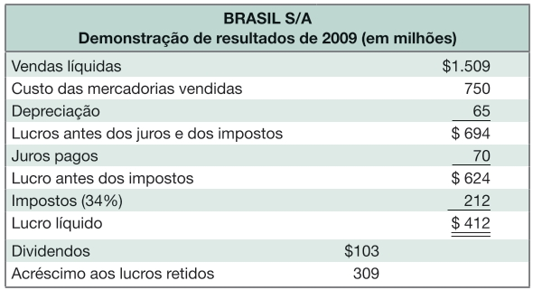
```
<span style="font-size: 80%">
Fonte: [@ross2013fundamentoscp2 pg.30]
</span>
<br>


**Itens que não afetam o caixa**

Item que não afeta o caixa: depreciação do ativo, *impairment*\
Item que afeta o caixa: aquisição do ativo e venda de ativo\
Item que afeta o demonstrativo: depreciação do ativo via tributos\

**Para o gestor financeiro, o tempo real dos fluxos de entrada e saída é essencial**

Baixa contábeis afetam o lucro líquido, mas não afetam o fluxo de caixa Baixa\
contábeis = depreciação

**Tempo e custos**
Curto e longo prazo\
Custos dos produtos vendidos = custos variáveis e custos fixos

## Impostos

Carga tributária\
Impostos sobre lucros (IRPJ)\
Outras contribuições e impostos locais


:::: {.blackbox data-latex=""}
::: {.center data-latex=""}
**Principais impostos e contribuições pagos no Brasil**
:::

**Tributos e Contribuições Federais**

- Imposto sobre Importação.\
- **IOF – Imposto sobre Operações Financeiras**. Incide sobre empréstimos, financiamentos e outras operações financeiras, e sobre ações.\
- **IPI – Imposto sobre Produto Industrializado. Cobrado das indústrias.**\
- **IRPF – Imposto de Renda Pessoa Física.**\
- **<span style="color:red">IRPJ – Imposto de Renda Pessoa Jurídica. Incide sobre o lucro das empresas.</span>**\
- ITR – Imposto sobre a Propriedade Territorial Rural.\
- CIDE – Contribuição de Intervenção no Domínio Econômico. Incide sobre petróleo e gás natural e seus derivados, e sobre álcool combustível.\
- COFINS – Contribuição para o Financiamento da Seguridade Social. Cobrado das empresas.\
- **<span style="color:red">CSLL – Contribuição Social sobre o Lucro Líquido.</span>**\
- FGTS – Fundo de Garantia do Tempo de Serviço. Percentual do salário de cada trabalhador com carteira assinada depositado pela empresa.\
- INSS – Instituto Nacional do Seguro Social. Percentual do salário de cada empregado cobrado da empresa (cerca de 28% – varia segundo o ramo de atuação) e do trabalhador (8%) para assistência à saúde.\
- PIS/Pasep – Programas de Integração Social e de Formação do Patrimônio do Servidor Público. Cobrado das empresas.\
- Contribuições para o Sistema “S” (Sebrae, SENAC, SENAI, SESI, SESC, etc).

**Impostos e Contribuições Estaduais**

- **ICMS – Imposto sobre Circulação de Mercadorias. Incide também sobre o transporte interestadual e intermunicipal e telefonia.**\
- **IPVA – Imposto sobre a Propriedade de Veículos Automotores.**\
- ITCMD – Imposto sobre a Transmissão Causa Mortis e Doação. Incide sobre herança.

**Impostos Municipais**

- **IPTU – Imposto sobre a Propriedade Predial e Territorial Urbana.**\
- **ISS ou ISSQN – Imposto Sobre Serviços. Cobrado das empresas.**\
- ITBI – Imposto sobre Transmissão de Bens Inter Vivos. Incide sobre a mudança de propriedade de imóveis.

::::
<span style="font-size: 80%">
Fonte: <http://www.senado.gov.br/noticias/jornal/cidadania/impostos/not03.htm>
</span>
<br>

**Imposto de renda da pessoa jurídica no Brasil**

IRPJ no Brasil = 15% ou 25%.\
CSLL = 9% para todas as empresas e 15% para instituições financeiras.
Imposto de Renda Marginal (IRPJ+CSLL) = 34%.


:::: {.blackbox data-latex=""}
::: {.center data-latex=""}
**Alíquotas do Imposto de Renda de Pessoas Jurídicas Tributadas pelo Lucro Real, Presumido ou Arbitrado**
:::

São contribuintes e, portanto, estão sujeitos ao pagamento do IRPJ, as pessoas jurídicas e as pessoas físicas a elas equiparadas, domiciliadas no País. Elas devem apurar o IRPJ com base no lucro, que pode ser real, presumido ou arbitrado.

**A alíquota do IRPJ é de 15% (quinze por cento)** sobre o lucro apurado, **com adicional de 10% sobre a parcela do lucro que exceder R$ 20.000,00 / mês.**

A parcela do lucro real que exceder ao resultado da multiplicação de **R$20.000,00 (vinte mil reais) pelo número dos meses** do respectivo período de apuração sujeita-se à incidência **do adicional, à alíquota de 10% (dez por cento).**

**A alíquota do adicional é única** para todas as pessoas jurídicas, inclusive instituições financeiras, sociedades seguradoras e assemelhadas.

::::
<span style="font-size: 80%">
Fonte: <http://receita.economia.gov.br/acesso-rapido/tributos/IRPJ>
</span>
<br>


:::: {.blackbox data-latex=""}
::: {.center data-latex=""}
**Contribuição Social sobre o Lucro Líquido CSLL**
:::

Estão sujeitas ao pagamento da CSLL as pessoas jurídicas e as pessoas físicas a elas equiparadas, domiciliadas no País. **A alíquota da CSLL é de 9% (nove por cento) para as pessoas jurídicas em geral, e de 15% (quinze por cento), no caso das pessoas jurídicas consideradas instituições financeiras, de seguros privados e de capitalização.**

A apuração da CSLL deve acompanhar a tributação do lucro adotada para o IRPJ.

**Atenção:**

1) As entidades sem fins lucrativos de que trata o inciso I do art. 12 do Decreto nº 3.048, de 06 de maio de 1999 , que não se enquadrem na imunidade ou isenção da Lei nº 9.532, de 1997 , devem apurar a base de cálculo e a CSLL devida.

2) As associações de poupança e empréstimo estão isentas do imposto sobre a renda, mas são contribuintes da contribuição social sobre o lucro líquido.

3) São isentas da CSLL as entidades fechadas de previdência complementar, relativamente aos fatos geradores ocorridos a partir de 1º de janeiro de 2002.

4) As entidades sujeitas à CSLL deverão ajustar o resultado do período com as adições determinadas e exclusões admitidas, conforme legislação vigente, para fins de determinação da base de cálculo da contribuição.

5) As entidades sujeitas a planificação contábil própria apuram a CSLL de acordo com essa planificação.

**Rendimentos de Capital (Investimentos Financeiros):**

22,5% para aplicações com prazo de até 180 dias;\
20,0% para aplicações com prazo de 181 até 360 dias;\
17,5% para aplicações com prazo de 361 até 720 dias;\
15,0% para aplicações com prazo acima de 720 dias.

**Fundos de ações**: 15%.

**Fundos de previdência:**
35% para investimentos por um prazo de até 2 anos;\
30% para investimentos de mais de 2 anos e menos de 4 anos;\
25% para investimentos de mais de 4 anos e menos de 6 anos;\
20% para investimentos de anos mais de 6 anos e menos de 8;\
15% para investimentos de mais de 8 anos e menos de 10 anos;\
10% para investimentos de mais de 10 anos.


::::
<span style="font-size: 80%">
Fonte: <http://receita.economia.gov.br/acesso-rapido/tributos/CSLL>
</span>
<br>


**Tributação única:** empresas que optam pelo regime **Simples Nacional**.\
**Tributação pelo lucro real** = % sobre o lucro real apurado no período.\
**Tributação pelo lucro presumido** = % sobre o lucro como % do faturamento no segmento em que atua a empresa.

Existem vários tributos federais, estaduais e municipais.\
Existem taxas e contribuições compulsórias (Senai, Senac e Sesi, Senar e sindicatos).

**Esses impostos são sempre repassados ao consumidor?**\
Depende de vários fatores, por exemplo, poder de mercado das empresas, possibilidade de substituição de produtos pelo consumidor e regulação setorial.

<br>
```{r, echo=FALSE, out.width='100%', fig.cap='Alíquotas tributárias da pessoa jurídica nos Estados Unidos', fig.pos='!htb', fig.topcaption=TRUE}
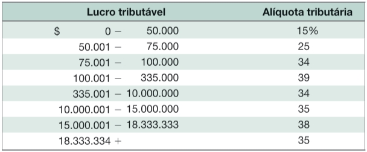
```
<span style="font-size: 80%">
Fonte: [@ross2013fundamentoscp2 pg.34]
</span>
<br>


<br>
```{r, echo=FALSE, out.width='100%', fig.cap='Impostos e alíquotas tributárias dos Estados Unidos', fig.pos='!htb', fig.topcaption=TRUE}
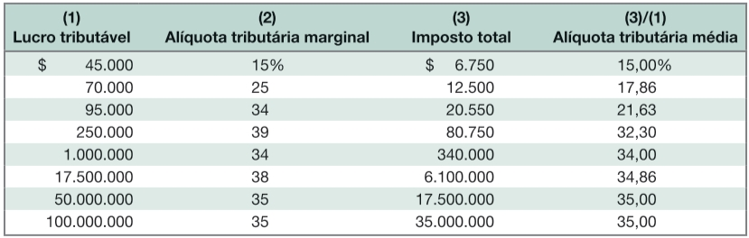
```
<span style="font-size: 80%">
Fonte: [@ross2013fundamentoscp2 pg.35]
</span>
<br>


## Fluxo de Caixa

Fluxo de caixa é a quantidade de \$ que entrou e a quantidade de \$ que saiu. Nenhuma demonstração de resultados apresenta essas informações organizadas.


**Fluxo de Caixa Operacional (FCO)** = o caixa gerado pelas atividades operacionais normais de produção e venda de uma empresa. **As despesas com financiamento não estão incluídas nessa conta.**

<br>
```{r, echo=FALSE, out.width='100%', fig.cap='Exemplo de fluxo de caixa', fig.pos='!htb', fig.topcaption=TRUE}
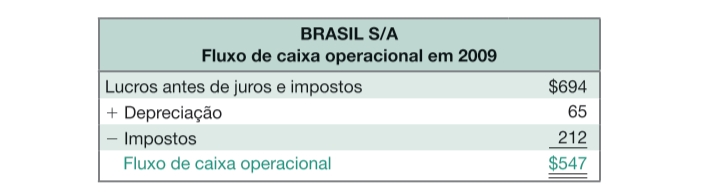
```
<span style="font-size: 80%">
Fonte: [@ross2013fundamentoscp2 pg.38]
</span>
<br>

**FCO = receitas – custos – impostos**\
FCO = lucros antes de juros e impostos + depreciação – impostos\
FCO negativo quase sempre indica problemas

Ver questões de definição: **incluir ou não despesas financeiras como operacional.** O autor afirma que não, pois não são despesas operacionais, pois **independem** das atividades comerciais da empresa.

<br>
```{r, echo=FALSE, out.width='100%'}
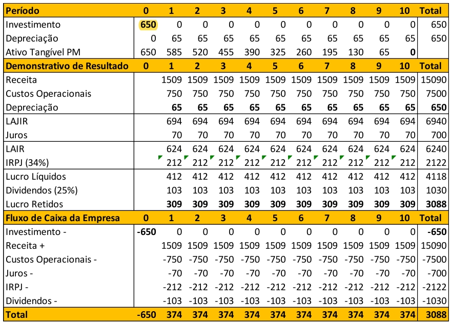
```
<br>

**Gastos de Capital**


$$
\mathrm{CAPEX = capital\;expenditure = investimentos}
$$
O valor gasto com ativos imobilizados menos o valor recebido da venda destes ativos. Gasto líquido é a despesa com ativos imobilizados, inclusive a depreciação do período.

<br>
```{r, echo=FALSE, out.width='100%', fig.cap='Exemplo de fluxo de caixa', fig.pos='!htb', fig.topcaption=TRUE}
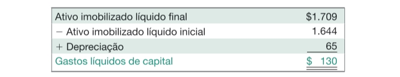
```
<span style="font-size: 80%">
Fonte: [@ross2013fundamentoscp2 pg.39]
</span>
<br>

**Variação do Capital Circulante Líquido**

Capital circulante líquido e variação do circulante

<br>
```{r, echo=FALSE, out.width='100%', fig.cap='Exemplo de fluxo de caixa', fig.pos='!htb', fig.topcaption=TRUE}
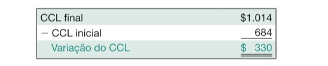
```
<span style="font-size: 80%">
Fonte: [@ross2013fundamentoscp2 pg.39]
</span>
<br>


Fluxo de caixa dos ativos = fluxo de caixa operacional + gastos de capital + variação do capital circulante líquido

Um fluxo de caixa negativo é bastante comum em uma empresa em crescimento ou com investimento.

<br>
```{r, echo=FALSE, out.width='100%', fig.cap='Exemplo de fluxo de caixa', fig.pos='!htb', fig.topcaption=TRUE}
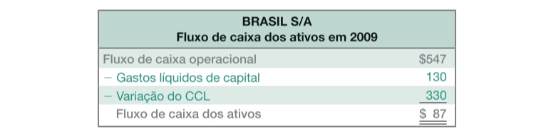
```
<span style="font-size: 80%">
Fonte: [@ross2013fundamentoscp2 pg.39]
</span>
<br>

**Observação sobre o Fluxo de Caixa “Livre”**\
Caixa que a empresa pode distribuir aos credores e acionistas.

$$
\mathrm{Fluxo\;de\;caixa\;para\;credores = juros\;pagos - novos\;empréstimos\;líquidos}
$$
O ideal é que os juros sejam menores que os empréstimos!

<br>
```{r, echo=FALSE, out.width='100%', fig.cap='Exemplo de fluxo de caixa', fig.pos='!htb', fig.topcaption=TRUE}
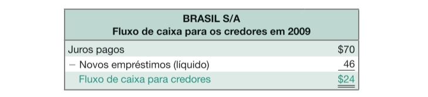
```
<span style="font-size: 80%">
Fonte: [@ross2013fundamentoscp2 pg.40]
</span>
<br>


Fluxo de Caixa para Acionistas = Dividendos e juros sobre o capital próprio pagos aos acionistas - aumentos de capital realizados pelos acionistas


<br>
```{r, echo=FALSE, out.width='100%', fig.cap='Exemplo de fluxo de caixa', fig.pos='!htb', fig.topcaption=TRUE}
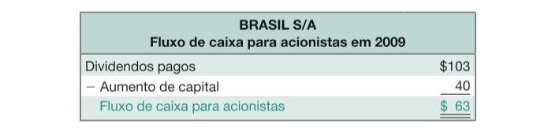
```
<span style="font-size: 80%">
Fonte: [@ross2013fundamentoscp2 pg.40]
</span>
<br>


<br>
```{r, echo=FALSE, out.width='100%', fig.cap='Exemplo: fluxo de caixa da Esmola Cola', fig.pos='!htb', fig.topcaption=TRUE}
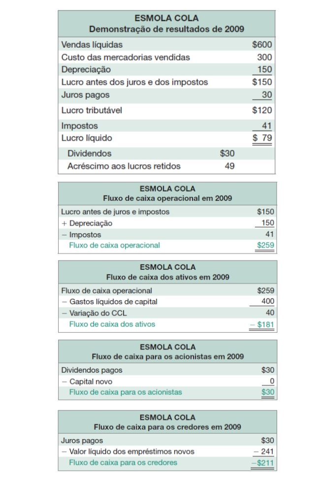
```
<span style="font-size: 80%">
Fonte: [@ross2013fundamentoscp2 pg.40]
</span>
<br>


<br>
```{r, echo=FALSE, out.width='100%', fig.pos='!htb', fig.topcaption=TRUE}
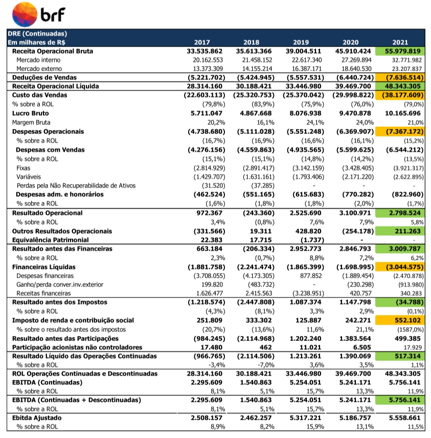
```
<br>

**<span style="color:red">Ver planilha para outras contas e detalhes do BP e DRE.</span>**


## Resumo e conclusões

Valor contábil é muito diferente de valor de mercado\
O valor de mercado é o relevante para a administraçõa corporativa\
O lucro líquido não é fluxo de caixa\
Fluxo de caixa é o resultado das operações, do gasto com capital e do capital circulante


<br>
```{r, echo=FALSE, out.width='100%', fig.cap='Resumo do fluxo de caixa', fig.pos='!htb', fig.topcaption=TRUE}
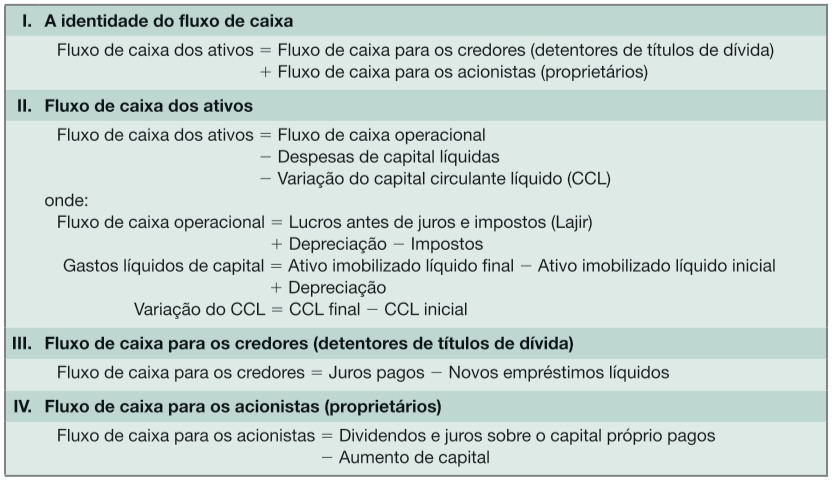
```
<span style="font-size: 80%">
Fonte: [@ross2013fundamentoscp2 pg.41]
</span>
<br>

**<span style="color:red">Revisão de conceitos e questões instigantes.</span>**

Liquidez elevada e liquidez baixa\
Contabilidade e fluxos de caixa

Valores contábeis versus valores de mercado – como surgem as diferenças\
Valores contábeis versus valores de mercado – é possível que o passivo exceda um ativo\

Fluxos de caixa operacionais – explicar as diferenças com lucro contábil\
Fluxo de caixa do ativo – se negativo, é ruim?\
Fluxo de caixa operacional – se negativo, é ruim?\
Fluxo de caixa para acionistas e credores– se negativo, é ruim? Como explicar?

Variação do capital circulante líquido – se negativo, é ruim? Como explicar?\
Gastos de capital – se negativo, é ruim? Como explicar?

Valor do negócio – valor de mercado de suas dívidas e de suas ações menos o caixa e os equivalentes de caixa\
Gerenciamento de resultados contábeis – diferimento de receitas, despesas e custos


